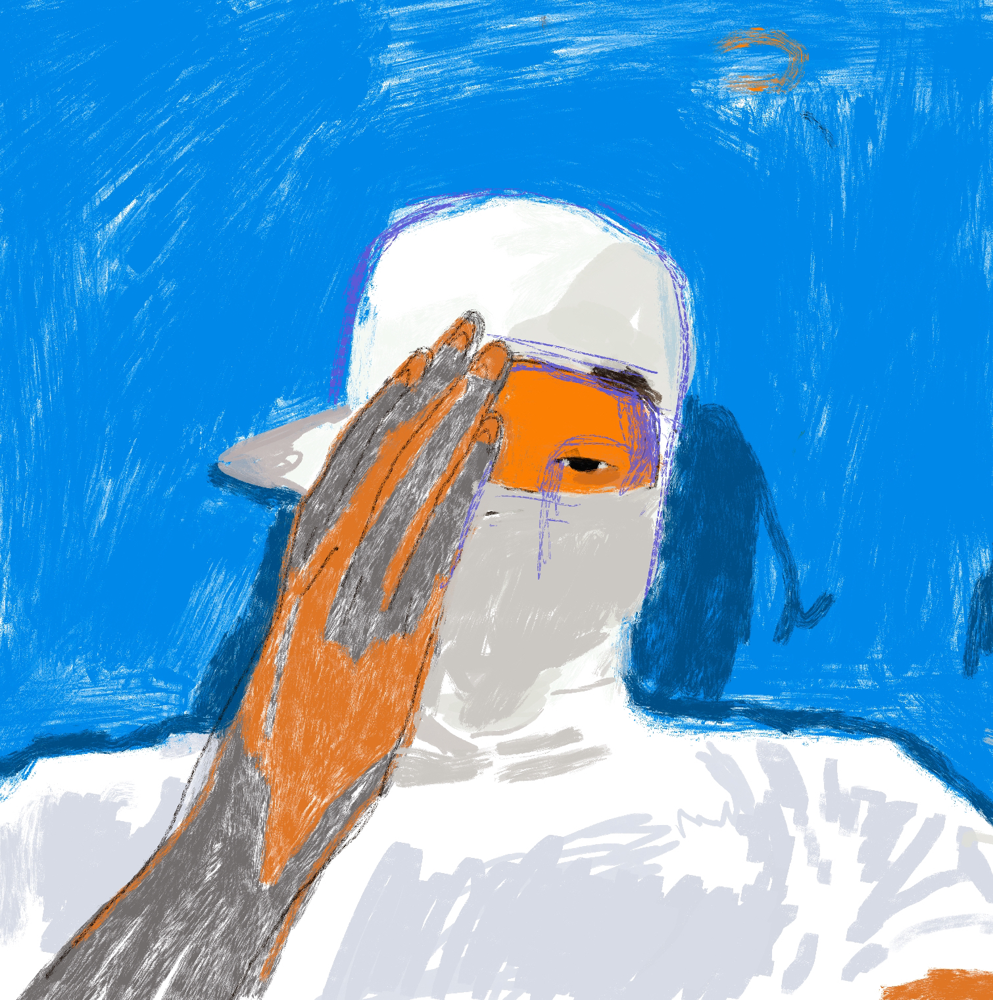
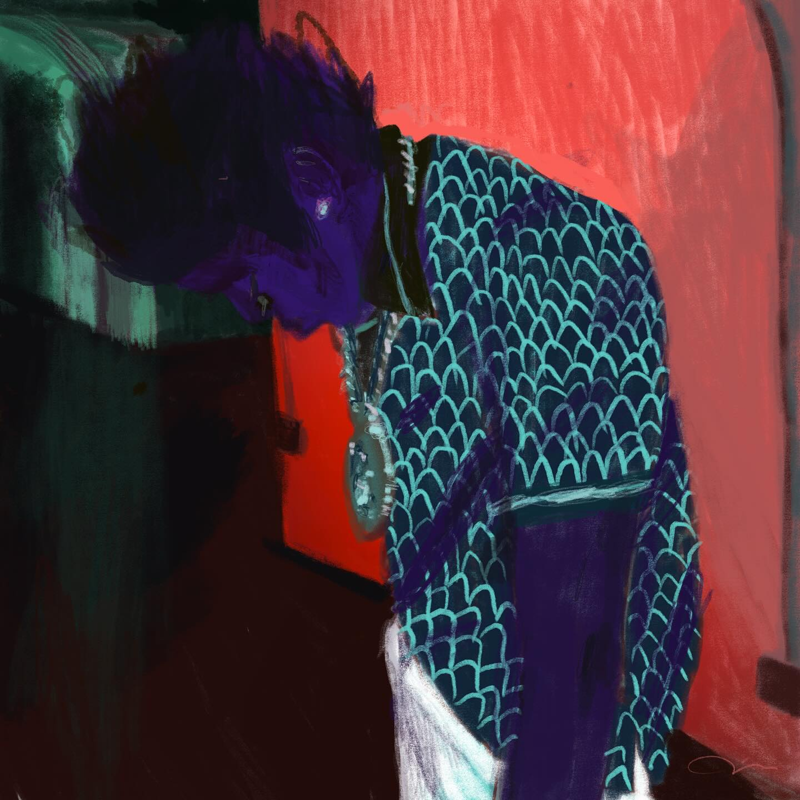

# Artworks -

*This is a portfolio of my artworks in the form of [Case Studies] the works you will see here may very between Graphics Design, Digital Design, Ux/Ui, Charcter Develoopment, and Product development. Please take the time to the review the works that I've shown here, Some are apart of projects I worked on and others are from my own curiosity, The projects are compartmentalized the help the the viewer to understand the wide range of works in my porfilio. I will be updating this priodicaly.*

#### Case Study | Feb 2006 - **Anime4breakfast!**
Anime4Breakfast! (a4b!) is a dynamic cultural space that celebrates the seamless blend of anime and daily life, turning each morning into an electrifying ritual for enthusiasts and casual fans alike. At its core, a4b! aims to invigorate the day’s start with the rich storytelling, vivid art, and diverse narratives that anime offers—a medium that inspires and captivates millions around the world.

From nostalgic classics that evoke the early days of anime fandom to the freshest releases that challenge the imagination, a4b! curates an experience where everyone can find their unique spark of joy. This isn’t just an appreciation forum—it’s a lifestyle brand rooted in the belief that anime, much like breakfast, can fuel creativity, provoke thought, and foster community.

What sets Anime4Breakfast! apart is its approach: celebrating anime as more than just entertainment but as an essential ingredient for daily inspiration. The community gathers to share morning reviews, daily reflections, and engage in conversations that resonate with the emotions, lessons, and sheer thrill that each episode brings. Whether it’s dissecting the deep philosophies of Studio Ghibli’s masterpieces or savoring the humor of slice-of-life series, a4b! invites every member to experience anime with fresh eyes—even before their first cup of coffee is finished.

More than a platform, a4b! is a movement that encourages new ways of connecting with the art form—through themed breakfast recipes inspired by anime kitchens, ‘Morning Zen’ segments featuring meditative clips and scenes, and exclusive events where fans can come together in the spirit of shared passion. By weaving anime into the start of each day, we emphasize that this beloved genre’s power extends beyond the screen—it’s a spark that energizes, motivates, and forms bonds.

Anime4Breakfast! doesn’t just want you to watch; it wants you to live anime—to carry the lessons, humor, and dreams from dawn to dusk. Because with a4b!, each sunrise isn’t just the start of a day—it’s the start of a new adventure.
To use the Minimal theme:

*I4NI* | Collection - Spooky

1. I4NI: A Testament to Misunderstood Youth
2. 
In the intricacies of societal perceptions, I4NI emerges as a profound artistic statement that dissects the veiled interpretations of youth seen through the lens of uncertainty and trepidation. This compelling piece encapsulates the duality of youthful existence—a narrative shaped not by their own truths but by the apprehensions and misapprehensions of those observing from the outside. The title itself, a cryptic expression of “Eye for an Eye,” challenges the viewer to reexamine the reactive, often defensive ways society approaches the unknown.

Through masterful visual storytelling and symbolic motifs, I4NI invites its audience to confront the paradox of fearing what one does not understand. It lays bare the complex reality where youth, vivid and boundless, are judged and mischaracterized by a world that projects its own insecurities upon them. The piece becomes both a mirror and a magnifying glass—a space where assumptions unravel and genuine understanding struggles to surface.

With every stroke and layered texture, the artwork evokes the raw essence of youthful rebellion juxtaposed with an unspoken yearning for recognition and empathy. It captures that liminal space between potential and perception, urging curators, critics, and observers to look beyond the surface, past their trepidations, and into the very soul of a generation too often defined by others’ fears.

#### Case Study | 2008 - Midnight Kids Academy - MDNKA

Midnight Kids Academy is a vibrant, multifaceted initiative dedicated to cultivating creativity, resilience, and empowerment within a community of ambitious individuals. Grounded in the belief that inspiration often awakens when the world sleeps, the academy champions those who unlock their full potential during the twilight hours—dreamers, passionate strivers, and innovative thinkers who come alive when the world is at rest.

With a mission to foster talent through immersive experiences, practical learning, and a robust support network, Midnight Kids Academy prioritizes skill-building, collaboration, and real-world application. The academy offers a wide array of programs and workshops tailored to diverse artistic and intellectual ambitions, spanning from fine arts and digital media to entrepreneurship and thought leadership.

Central to the philosophy of Midnight Kids Academy is the idea that genuine growth comes from pushing boundaries and venturing into the unknown. Its curriculum defies traditional learning methods, featuring unconventional schedules, nocturnal brainstorming sessions, and mentorship by accomplished experts who themselves have succeeded through unorthodox paths.

Community lies at the core of Midnight Kids Academy. This isn’t just a learning space—it’s a collective of like-minded individuals who inspire, share, and uplift one another. Participants are encouraged to step out of their comfort zones, channel their innate creativity, and transform their ideas into impactful realities.

Whether fueled by the quiet solitude of midnight musings or the energetic exchange of late-night collaborations, Midnight Kids Academy serves as a guiding light for those eager to explore new frontiers. Here, creativity knows no bounds, innovation never ceases, and the night becomes a canvas for shaping the future.

*Sweet sweetblack's Badass Song* | Collection - Sepia 

1. The ideal is a peaceful depiction of (Kodak Black) as Sweet back from Melvin than people's movie (Sweetsweet back's badassssong) I always had a thing for a black exploitation films, and I thought this was a perfect match given the way that Kodak Black grew up and how sweet back grew up in the film. They were almost seamless.

### Configuration variables

