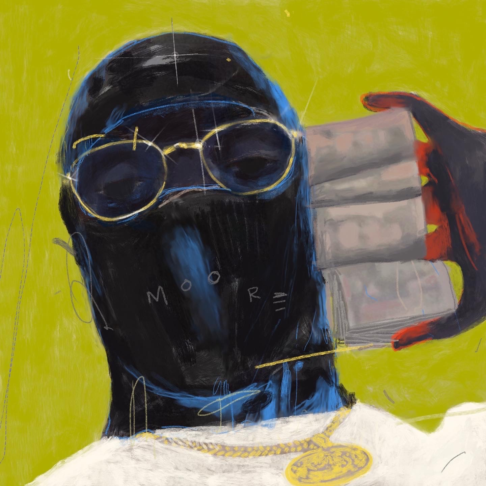
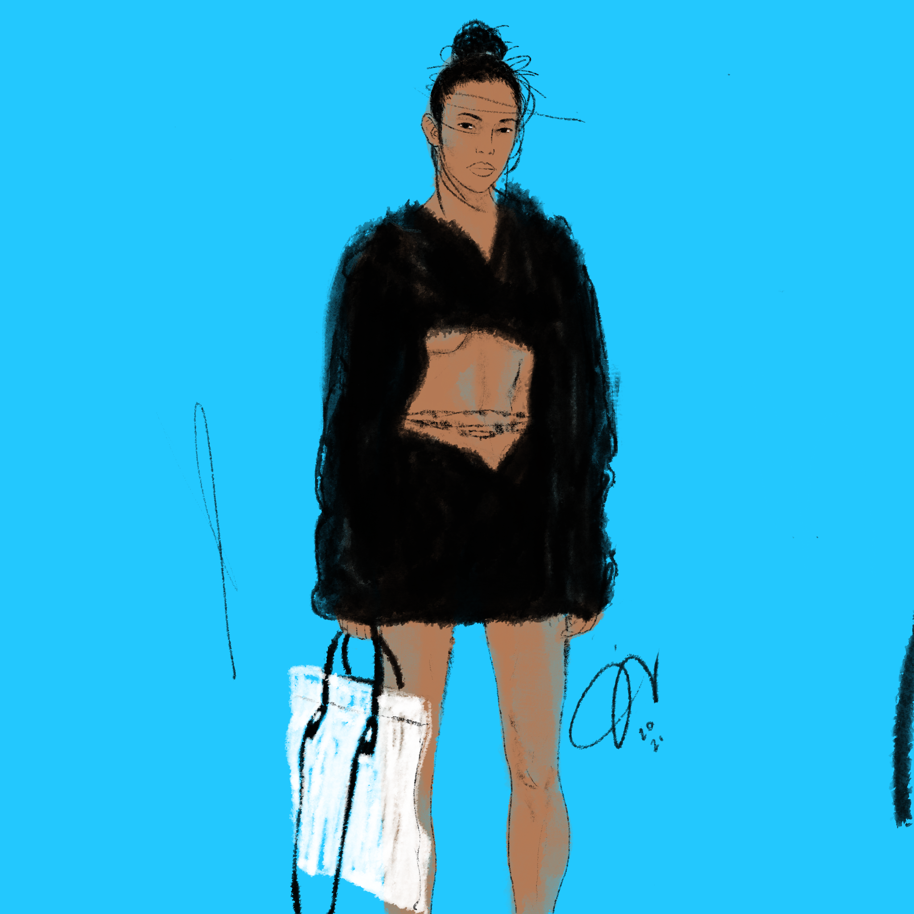

**Trumpet over Giza 1961 Blue** | Collection - Veil of the Sphinx 2024 / Apr.

---

The trumpet symbolize alignment, I thought — did Armstrong’s presence in 1961 herald a hidden dialogue between the stars and ancient structures? The Sphinx, mute and eternal, watches as though guarding a riddle yet unsolved, a cipher in the language of music and sand.

**Moor** | Collection - Spooky - 2022 / Jul.

---

This was the beginnning of it all the first ads for anime4breakfast! -- going off of the **JoyBoy** logo, creating that this ads just followed that concept.

**White Bag** | Collection - Muse 2 - 2022 / Jul.

---

This was the beginnning of it all the first ads for anime4breakfast! -- going off of the **JoyBoy** logo, creating that this ads just followed that concept.

**Immortal Sosa** | Collection - Sepia - 2022 / Jul.

---

This was the beginnning of it all the first ads for anime4breakfast! -- going off of the **JoyBoy** logo, creating that this ads just followed that concept.

**I4NI** | Collection - Spooky - 2022 / Jul.

---

**I4NI**: A Testament to Misunderstood Youth
In the intricacies of societal perceptions, I4NI emerges as a profound artistic statement that dissects the veiled interpretations of youth seen through the lens of uncertainty and trepidation. The title itself, a cryptic expression of “**Eye for an Eye**,” challenges the viewer to reexamine the reactive, often defensive ways society approaches the unknown.

**Sweet sweetblack’s Badass Song** | Collection - Sepia - 2023 May.

---

It’s within this framework that one can draw a seamless, almost mythical comparison to Kodak Black—a contemporary artist whose life and art form an unscripted narrative of struggle and tenacity. His world reflects the bruised, unfiltered resilience that Sweetback embodied, breathing life into the shared tale of overcoming systemic adversity.

**The Devil's Shadow** | Collection - Phantoms of Blue - 2023 Mar.

---

As the (**Phantom**) of Blues, Robert Johnson’s legacy is more than just his music—it is an enduring symbol of how stories become legends, of how the unseen can captivate and inspire. His spirit continues to haunt the crossroads of history and myth, forever leaving behind an enigmatic trail that invites endless curiosity and speculation.
 

**Morgan's Last Gig** | Collection - Phantom's of Blue - 2023 / Feb.

---

Lee’s journey to becoming an urban legend began with this unyielding (**Love**). It wasn’t just about mastering an instrument; it was about making it speak. He could translate emotion into sound, pulling from the depths of joy, heartache, and everything in between.

**Some kind of Blue** | Collection - Phantom's of Blue - 2023 / Jan.

---

This painting is a reflection of Davis’s life: a blend of triumph and turmoil, this process of of a urban legend is (**Trauma**) genius and solitude. It captures the spirit of a man whose music transcended barriers, leaving a legacy that resonates long after the final note.

**Penthouse** | Collection - Muse 2 - 2023 / Mar.

---

As I created this piece, my focus was entirely on her—a woman standing by her penthouse window, lost in her own world. I wanted to capture her essence, the quiet confidence in her posture, the way she commanded attention effortlessly. This work, part of my *Muse* collection, is an homage to her presence—intoxicating and magnetic, a reminder of how some individuals hold an undeniable power simply by being.

**Madame Bingo** | Collection - Muse 1 - 2023 / Jan.

---

Lee’s journey to becoming an urban legend began with this unyielding (**Love**). It wasn’t just about mastering an instrument; it was about making it speak. He could translate emotion into sound, pulling from the depths of joy, heartache, and everything in between.

**Oh Mini** | Collection - Muse 1 - 2023 / Jan.

---

Lee’s journey to becoming an urban legend began with this unyielding (***Love***). It wasn’t just about mastering an instrument; it was about making it speak. He could translate emotion into sound, pulling from the depths of joy, heartache, and everything in between.

**The Great Reset** | Collection - Spooky - 2023 / Jan.

---

This piece belongs to the Spooky collection, where themes of the unknown, the uncanny, and the transformative power of darkness take center stage. Here, "The Great Reset" positions itself as a commentary on the intersection of human fragility and resilience, speaking to both the individual and collective desire for a fresh start in an unrelenting, mysterious universe.

**Got your back** | Collection - Spooky - 2023 / Jan.

---

"Got Your Back" is an evocative artwork that navigates the dualities of protection and suspicion. A faceless figure stands in the foreground, cloaked in muted greens, their posture suggesting a quiet vigilance. Behind them, a second figure emerges from the shadows, their eyes piercing through a masked visage, a blend of trust and veiled intentions.

**Keisha Bed** | Collection - Sepia - 2023 / Jan.

---

Lee’s journey to becoming an urban legend began with this unyielding (***Love***). It wasn’t just about mastering an instrument; it was about making it speak. He could translate emotion into sound, pulling from the depths of joy, heartache, and everything in between.

**3Essentials** | Collection - Muse 1 - 2022 / Jul.

---

This was the beginnning of it all the first ads for anime4breakfast! -- going off of the **JoyBoy** logo, creating that this ads just followed that concept.

**Coliseum** | Collection - Otomo Drive - 2023 / Jun

---

Coliseum, is a piece basic on the movie Akira by 
