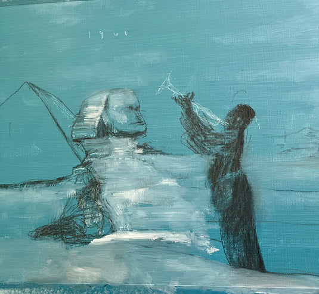
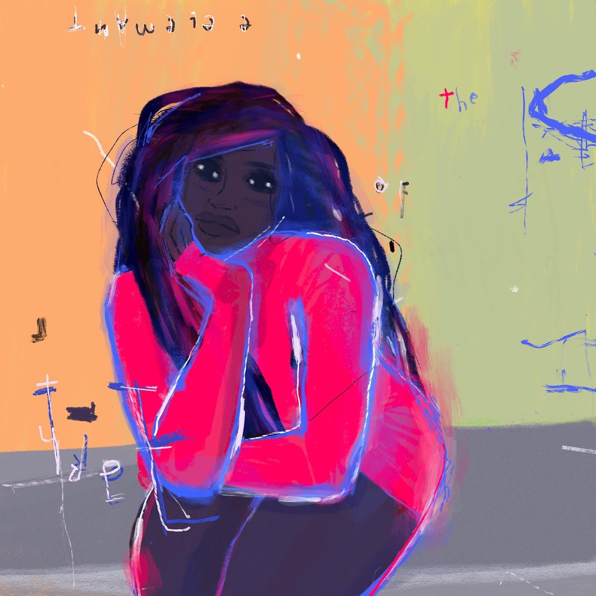
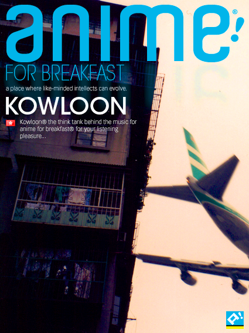

##### Introduction
This is a portfolio of my artworks in the form of [Case Studies] the works you will see here may very between Graphics Design, Digital Design, Ux/Ui, Charcter Develoopment, and Product development. Please take the time to the review the works that I’ve shown here, Some are apart of projects I worked on and others are from my own curiosity, The projects are compartmentalized the help the the viewer to understand the wide range of works in my porfilio. I will be updating this priodicaly.
[Link to another page](./another-page.html).

#### Artworks Codex Feb 2019 - present
This was the chapter where I made the conscious decision to prioritize my own growth and well-being. I knew it was time to give back to myself, to nurture that part of me that had been waiting patiently beneath the surface. I embarked on a journey into the depths of my creative expression, embracing the process not just as an artist but as an individual seeking transformation. Through the lens of fine art, I discovered the freedom to explore new techniques, push my boundaries, and fully immerse in the act of creation. This practice became a blend of artistic passion and inner discipline—a space where I could reflect, refine, and rediscover who I am at my core.

Engaging in this way wasn’t just about making art; it was about crafting a life where creativity and mindfulness intertwined, giving me the foundation to express myself with authenticity and purpose.

##### Trumpet over Giza Blue | Collection - *Veil of the Sphinx*

##### I4NI |	Collection - Spooky

I4NI: A Testament to Misunderstood Youth
In the intricacies of societal perceptions, I4NI emerges as a profound artistic statement that dissects the veiled interpretations of youth seen through the lens of uncertainty and trepidation. This compelling piece encapsulates the duality of youthful existence—a narrative shaped not by their own truths but by the apprehensions and misapprehensions of those observing from the outside. The title itself, a cryptic expression of “Eye for an Eye,” challenges the viewer to reexamine the reactive, often defensive ways society approaches the unknown.
* * *

##### Sweet sweetblack’s Badass Song | Collection - Sepia

The Art of Resilience: Kodak Black as the Modern Sweetback
In the luminous canon of Blaxploitation cinema, Melvin Van Peebles’ Sweet Sweetback’s Baadasssss Song stands as a defiant, kinetic ode to survival, resistance, and the raw essence of self-determination. It’s within this framework that one can draw a seamless, almost mythical comparison to Kodak Black—a contemporary artist whose life and art form an unscripted narrative of struggle and tenacity. His world reflects the bruised, unfiltered resilience that Sweetback embodied, breathing life into the shared tale of overcoming systemic adversity.
* * *

##### The Ddevil's Shadow | Collection - Phantoms of Blue

As the (***Phantom***) of Blues, Robert Johnson’s legacy is more than just his music—it is an enduring symbol of how stories become legends, of how the unseen can captivate and inspire. His spirit continues to haunt the crossroads of history and myth, forever leaving behind an enigmatic trail that invites endless curiosity and speculation.
* * *

##### Morgan's Last Gig | Collection - Phantom's of Blue

Lee’s journey to becoming an urban legend began with this unyielding (***Love***). It wasn’t just about mastering an instrument; it was about making it speak. He could translate emotion into sound, pulling from the depths of joy, heartache, and everything in between. His trumpet was more than an instrument; it was a medium through which he shared his love for life, jazz, and the culture that surrounded it. The way he played was personal, almost as if he was having a conversation with each listener, drawing them into a shared experience of rhythm and soul.
* * *

##### Some kind of Blue | Collection - Phantom's of Blue

This painting is a reflection of Davis’s life: a blend of triumph and turmoil, this process of of a urban legend is (***Trauma***) genius and solitude. It captures the spirit of a man whose music transcended barriers, leaving a legacy that resonates long after the final note.
* * *

##### Penthouse | Collection - Muse 2
* * *

##### Madame Bingo | Collection - Muse 1
* * *

##### Oh Mini | Collection - Muse 1
* * *

##### The Great Reset | Collection - Spooky
* * *

##### Got your back | Collection - Spooky
* * *

##### Keisha Bed | Collection - Sepia
* * *

##### 3Essentials | Collection - Muse 1

#### Art Collectives and Personal Project Outreach

I collaborated with artists across a range of mediums to support and refine their creative practices. Through these partnerships, I gained hands-on experience in understanding the unique techniques and perspectives that each art form demands. This involvement not only deepened my appreciation for diverse artistic expressions but also enhanced my ability to contribute effectively to creative projects, bridging ideas and execution across various crafts.

##### Case study - anime4breakfast

##### a4b! blog season -
Anime4Breakfast! (a4b!) is a dynamic cultural space that celebrates the seamless blend of anime and daily life, turning each morning into an electrifying ritual for enthusiasts and casual fans alike. At its core, a4b! aims to invigorate the day’s start with the rich storytelling, vivid art, and diverse narratives that anime offers—a medium that inspires and captivates millions around the world.*

##### a4b! issue #2 banner - 

> "This marked the inception of JoyBoy. JoyBoy was born from the emotions that surge within me during the creative process. I aimed to capture and embody that essence in this banner after being profoundly inspired by this image."eated from the feelings I have when I create my, I wanted to inbody that feeling in the banner after seeing that this image."

##### Case study - KC93 RR

##### Case study - MDNKA Midnight Kids Academy

Midnight Kids Academy is a vibrant, multifaceted initiative dedicated to cultivating creativity, resilience, and empowerment within a community of ambitious individuals. Grounded in the belief that inspiration often awakens when the world sleeps, the academy champions those who unlock their full potential during the twilight hours—dreamers, passionate strivers, and innovative thinkers who come alive when the world is at rest.

With a mission to foster talent through immersive experiences, practical learning, and a robust support network, Midnight Kids Academy prioritizes skill-building, collaboration, and real-world application. The academy offers a wide array of programs and workshops tailored to diverse artistic and intellectual ambitions, spanning from fine arts and digital media to entrepreneurship and thought leadership.

Central to the philosophy of Midnight Kids Academy is the idea that genuine growth comes from pushing boundaries and venturing into the unknown. Its curriculum defies traditional learning methods, featuring unconventional schedules, nocturnal brainstorming sessions, and mentorship by accomplished experts who themselves have succeeded through unorthodox paths.

#### Game Development
* * *
##### Case study - BPH Battle Park High

*Battle Park High Overview*

*Battle Park High* is an exhilarating pixel art beat ‘em up that plunges players into a gritty, adrenaline-fueled fight for loyalty, survival, and justice. Set against the backdrop of a chaotic cityscape, this game tells the story of two street-smart teenagers, Leo and Maya, who find themselves pitted against a ruthless network of rival gangs when their mentor and the charismatic leader of their own gang, The Shadows, is kidnapped.
    
The game opens with a chilling scene: The Shadows’ stronghold has been ambushed, leaving behind nothing but destruction and a cryptic message scrawled on the walls by the assailants. The news hits Leo and Maya like a punch to the gut—their leader, the one who pulled them off the streets and showed them a life beyond fear and desperation, is now a captive. The rival gangs have united, each with its own sinister reasons for wanting The Shadows to fall. But Leo and Maya aren’t about to let their family crumble without a fight.
    
As players journey through *Battle Park High*, they’ll guide Leo and Maya through a labyrinthine world filled with pulsating synthwave music, explosive street brawls, and unexpected alliances. From abandoned amusement parks turned makeshift arenas to neon-lit rooftops patrolled by ruthless enforcers, every level pushes players deeper into the heart of gang warfare. Each rival gang has its own flair—The Rust Hounds, masters of brute force with their lead pipes and chains, and The Velvet Knives, a cunning group who rule the city’s dark alleys with unmatched agility.
    
But *Battle Park High* isn’t just about the fights; it’s a narrative-driven experience that forces players to confront the thin line between loyalty and ambition. As the story unfolds, Leo and Maya will uncover secrets that threaten to fracture The Shadows from within, raising the stakes far beyond a mere rescue mission. The duo must rely not only on their combat prowess but on the bonds they’ve forged—and their wits—to navigate shifting loyalties, betrayals, and the ruthless hierarchy of the streets.

