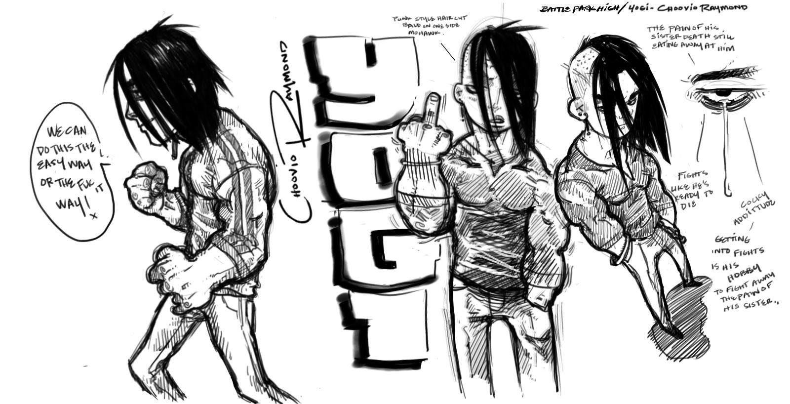
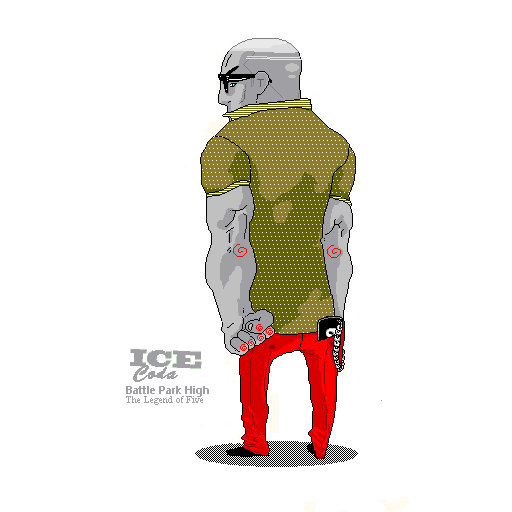

##### Portfolio Introduction
> This is a portfolio of my artworks in the form of [Case Studies] the works you will see here may very between Graphics Design, Digital Design, Ux/Ui, Charcter Develoopment, and Product development. Please take the time to the review the works that I’ve shown here, Some are apart of projects I worked on and others are from my own curiosity, The projects are compartmentalized the help the the viewer to understand the wide range of works in my porfilio. I will be updating this priodicaly.

## Artworks Codex Feb 2019 - present
This was the chapter where I made the conscious decision to prioritize my own growth and well-being. I knew it was time to give back to myself, to nurture that part of me that had been waiting patiently beneath the surface. I embarked on a journey into the depths of my creative expression, embracing the process not just as an artist but as an individual seeking transformation. Through the lens of fine art, I discovered the freedom to explore new techniques, push my boundaries, and fully immerse in the act of creation. This practice became a blend of artistic passion and inner discipline—a space where I could reflect, refine, and rediscover who I am at my core.

Engaging in this way wasn’t just about making art; it was about crafting a life where creativity and mindfulness intertwined, giving me the foundation to express myself with authenticity and purpose.

#### Trumpet over Giza 1961 Blue | Collection - *Veil of the Sphinx*
The trumpet symbolize alignment, I thought — did Armstrong’s presence in 1961 herald a hidden dialogue between the stars and ancient structures? The Sphinx, mute and eternal, watches as though guarding a riddle yet unsolved, a cipher in the language of music and sand.

The numeral 1961, faint but deliberate, offers a historical anchor while leaving room for speculation: Was this a forgotten performance under the Egyptian sky, or does it signify a temporal crossroads, merging Armstrong’s revolutionary art with Egypt’s enduring mysteries? The interplay between sound and silence, past and present, suggests a deeper, esoteric truth embedded within.

#### I4NI |	Collection - Spooky

I4NI: A Testament to Misunderstood Youth
In the intricacies of societal perceptions, I4NI emerges as a profound artistic statement that dissects the veiled interpretations of youth seen through the lens of uncertainty and trepidation. This compelling piece encapsulates the duality of youthful existence—a narrative shaped not by their own truths but by the apprehensions and misapprehensions of those observing from the outside. The title itself, a cryptic expression of “Eye for an Eye,” challenges the viewer to reexamine the reactive, often defensive ways society approaches the unknown.
* * *

#### Sweet sweetblack’s Badass Song | Collection - Sepia

The Art of Resilience: Kodak Black as the Modern Sweetback
In the luminous canon of Blaxploitation cinema, Melvin Van Peebles’ Sweet Sweetback’s Baadasssss Song stands as a defiant, kinetic ode to survival, resistance, and the raw essence of self-determination. It’s within this framework that one can draw a seamless, almost mythical comparison to Kodak Black—a contemporary artist whose life and art form an unscripted narrative of struggle and tenacity. His world reflects the bruised, unfiltered resilience that Sweetback embodied, breathing life into the shared tale of overcoming systemic adversity.
* * *

#### The Ddevil's Shadow | Collection - Phantoms of Blue

As the (***Phantom***) of Blues, Robert Johnson’s legacy is more than just his music—it is an enduring symbol of how stories become legends, of how the unseen can captivate and inspire. His spirit continues to haunt the crossroads of history and myth, forever leaving behind an enigmatic trail that invites endless curiosity and speculation.
* * *

#### Morgan's Last Gig | Collection - Phantom's of Blue

Lee’s journey to becoming an urban legend began with this unyielding (***Love***). It wasn’t just about mastering an instrument; it was about making it speak. He could translate emotion into sound, pulling from the depths of joy, heartache, and everything in between. His trumpet was more than an instrument; it was a medium through which he shared his love for life, jazz, and the culture that surrounded it. The way he played was personal, almost as if he was having a conversation with each listener, drawing them into a shared experience of rhythm and soul.
* * *

#### Some kind of Blue | Collection - Phantom's of Blue

This painting is a reflection of Davis’s life: a blend of triumph and turmoil, this process of of a urban legend is (***Trauma***) genius and solitude. It captures the spirit of a man whose music transcended barriers, leaving a legacy that resonates long after the final note.
* * *

#### Penthouse | Collection - Muse 2

As I created this piece, my focus was entirely on her—a woman standing by her penthouse window, lost in her own world. I wanted to capture her essence, the quiet confidence in her posture, the way she commanded attention effortlessly. This work, part of my *Muse* collection, is an homage to her presence—intoxicating and magnetic, a reminder of how some individuals hold an undeniable power simply by being.
* * *

#### Madame Bingo | Collection - Muse 1
* * *

#### Oh Mini | Collection - Muse 1
* * *

#### The Great Reset | Collection - Spooky
This piece belongs to the Spooky collection, where themes of the unknown, the uncanny, and the transformative power of darkness take center stage. Here, "The Great Reset" positions itself as a commentary on the intersection of human fragility and resilience, speaking to both the individual and collective desire for a fresh start in an unrelenting, mysterious universe.
* * *

#### Got your back | Collection - Spooky
This piece delves into the fragility of human relationships, portraying the tension of relying on another while questioning their motives. The use of subdued colors and dynamic strokes evokes an eerie, dreamlike quality, drawing viewers into its haunting atmosphere. Got Your Back asks the poignant question: in a world of hidden faces and uncertain allies, who can we truly trust?

This work seamlessly combines the unsettling tone of the Spooky collection with a deeply personal exploration of loyalty and vulnerability.
* * *

#### Keisha Bed | Collection - Sepia
* * *

#### 3Essentials | Collection - Muse 1

## Art Collectives and Personal Project Outreach

I collaborated with artists across a range of mediums to support and refine their creative practices. Through these partnerships, I gained hands-on experience in understanding the unique techniques and perspectives that each art form demands. This involvement not only deepened my appreciation for diverse artistic expressions but also enhanced my ability to contribute effectively to creative projects, bridging ideas and execution across various crafts.

### Case study - anime4breakfast - 2006

---

**The Conception and Development of Anime4Breakfast**  

*Anime4Breakfast* was born from a desire to carve out a space in modern culture where the timeless charm of 1980s anime and the mystique of neon-drenched cityscapes could coexist as a distinct artistic narrative. Rooted in nostalgia, the concept emerged as a sanctuary for the imagination—an ode to the golden age of hand-drawn animation and the electrifying atmosphere of urban nightscapes.

The project began as a personal reflection, a way to compartmentalize and celebrate a specific era of artistry that has profoundly shaped visual culture. Morning routines, often laden with repetition, inspired the metaphor of "breakfast"—a ritual of sustenance for the creative mind, paired with the vibrant storytelling of 80s anime. This unique blend became a platform to explore themes of solitude, wonder, and the pursuit of identity in a rapidly evolving world.

To develop *Anime4Breakfast*, the visual and conceptual elements were curated to evoke a blend of dreamlike nostalgia and forward-thinking aesthetics. Drawing inspiration from iconic anime such as *Akira*, *Bubblegum Crisis*, and *City Hunter*, alongside the evocative imagery of glowing skyscrapers, rain-slicked streets, and buzzing neon signs, the project flourished into a distinct expression of the past-meets-future mindset.

As *Anime4Breakfast* grew, it became more than an artistic exploration; it became a lifestyle philosophy—a tribute to those quiet, introspective moments where one’s connection to art and self-expression becomes a cornerstone of creativity.

--- 

#### a4b! blog season -
> *Anime4Breakfast! (a4b!) is a dynamic cultural space that celebrates the seamless blend of anime and daily life, turning each morning into an electrifying ritual for enthusiasts and casual fans alike. At its core, a4b! aims to invigorate the day’s start with the rich storytelling, vivid art, and diverse narratives that anime offers—a medium that inspires and captivates millions around the world.*

#### a4b! issue #2 banner - 

> *"This marked the inception of JoyBoy. JoyBoy was born from the emotions that surge within me during the creative process. I aimed to capture and embody that essence in this banner after being profoundly inspired by this image."eated from the feelings I have when I create my, I wanted to inbody that feeling in the banner after seeing that this image."*

##### Case study - KC93 RR

##### Case study - MDNKA Midnight Kids Academy

Midnight Kids Academy is a vibrant, multifaceted initiative dedicated to cultivating creativity, resilience, and empowerment within a community of ambitious individuals. Grounded in the belief that inspiration often awakens when the world sleeps, the academy champions those who unlock their full potential during the twilight hours—dreamers, passionate strivers, and innovative thinkers who come alive when the world is at rest.

With a mission to foster talent through immersive experiences, practical learning, and a robust support network, Midnight Kids Academy prioritizes skill-building, collaboration, and real-world application. The academy offers a wide array of programs and workshops tailored to diverse artistic and intellectual ambitions, spanning from fine arts and digital media to entrepreneurship and thought leadership.

Central to the philosophy of Midnight Kids Academy is the idea that genuine growth comes from pushing boundaries and venturing into the unknown. Its curriculum defies traditional learning methods, featuring unconventional schedules, nocturnal brainstorming sessions, and mentorship by accomplished experts who themselves have succeeded through unorthodox paths.

## Game Development
#### Case study - BPH Battle Park High

*Park High Reborn*  

Metreon City is unraveling. Ravaged by violent turf wars, its streets belong to rival gangs of angry teens, each vying for dominance in an endless cycle of chaos. The city’s most dangerous battlegrounds aren't just the alleyways but the high schools, where grudges turn into warfare and alliances are forged in blood.  

At the heart of this turmoil is **Park High**, a school barely holding itself together under an uneasy truce with a rival institution. But peace shatters when Yogi, a spirited freshman, is ambushed and left hospitalized by **T.D.F.W.**—The Dance Floor Wolves—a ruthless gang on the rise, led by the cold-blooded Silas Marks and his band of five notorious loners.  

Yogi’s closest friends—Winnie, Tum-Tum, Pooma, and "Ice" Coda—are forced to make a choice. Bound by loyalty to their fallen friend and a shared pride in their school, these four reluctant allies embark on a dangerous journey across enemy territory, where every corner hides a threat and every shadow is a trap.  

Though they come from different walks of life and aren’t the tightest-knit group, their mutual respect and unwavering determination unite them. To bring down T.D.F.W. and reclaim their school, they must confront not only the Wolves but also their own fears, doubts, and limits.  

This is the story of four freshmen rising to legendary status. A tale of brotherhood forged in fire, of a school defended against all odds, and of a city on the brink. But the question remains: **will they have what it takes to survive the fight of their lives?** 

#### The famous five freshmen of the first year battle:

*YOGI - Choovio Raymond
Park High All Boys Continuation School
1st Year Freshmen*

#### Yogi: The Relentless Fighter of Park High 

Yogi, a hotheaded freshman with a volatile temper, is a name that strikes fear and respect throughout Metreon. Expelled from nearly every middle school in the city for fighting and defiance, his reputation as an unrelenting brawler was forged in the chaos of street battles and schoolyard clashes. Yogi's combative nature stems from a deeply personal tragedy—the loss of his sister, Enola, in an accident he witnessed as a child. This event left him grappling with life and death, channeling his pain into a relentless pursuit of strength.  

Known for his unpredictable fighting style and stamina, Yogi never backs down, earning him the moniker “The Zombie” among peers for his refusal to stay down in a fight. Despite countless defeats, he improves with every battle, his resilience unmatched. By the time he reached Park High, Yogi’s goal was clear: to become the school’s first undisputed champion and solidify his legacy.  

When TDFW, a notorious gang led by Silas Marks, sought to recruit him, Yogi stood his ground, refusing to bow to anyone. Silas responded with a ruthless ambush, leaving Yogi and his faction hospitalized and disqualified from Park High’s freshman tournament. Despite the setback, Yogi’s unyielding spirit and reputation as a relentless fighter continue to define him, proving that even in defeat, his story is far from over. [Deep story verion](./yogis-story.md)

*ICE CODA
Park High All Boys Continuation School
1st Year Freshmen*

**Ice Coda: The Shadow King of Park High**  

From the moment Ice Coda set foot in Park High, the school’s corridors buzzed with tension. Known across Metreon City as a figure of ruthless precision, Ice wasn’t there to blend in—he was there to conquer. Cold, calculating, and unshakable, he carried the weight of a reputation that left even the boldest delinquents hesitant to cross him.  

Ice’s legend began in middle school, where he and his closest friend ruled as an unstoppable duo. Together, they dismantled every rival, cementing their reign by their second year. But Ice’s ambition demanded more. In a chilling act of betrayal, he challenged his friend to a fight for supremacy and, even after securing victory, broke his arm to send a brutal message: power was his alone. The betrayal earned him the name “Ice,” a moniker that captured the frost in his veins.

Pixel sprite variation of *ICE Coda* 

At Park High, Ice’s reputation as a tactical mastermind preceded him. In the Freshman Battle tournament, his surgical fighting style left opponents battered and broken before they realized the fight had even started. His cold efficiency and unflinching calm made him the most feared contender in the arena, his icy stare enough to shake even the most hardened fighters.  

When chaos erupted and TDFW disrupted the balance of power, Ice found himself drawn into an uneasy alliance with Pooma and Tum-Tum. It wasn’t loyalty or friendship that compelled him—it was strategy. Ice saw opportunity in the turmoil, leveraging the partnership to solidify his control and set the stage for his ultimate goal: to rule both Park High and Metreon City.  

Every move Ice made was deliberate, every step calculated. While others fought with brute force and raw emotion, Ice weaponized his intelligence and precision, turning the chaos around him into a battlefield of his design. To his enemies, he was an unstoppable force; to his allies, a dangerous enigma.  

With Park High descending into a storm of rivalries and shifting loyalties, Ice Coda stands at the eye of it all, calm, composed, and deadly. He isn’t fighting for survival—he’s fighting to rule. And for those who dare to stand in his way, Ice’s chilling wrath will leave them broken and forgotten, just another step on his path to becoming the undisputed king of Metreon City. [Deep story verion](./coda-story.md)

