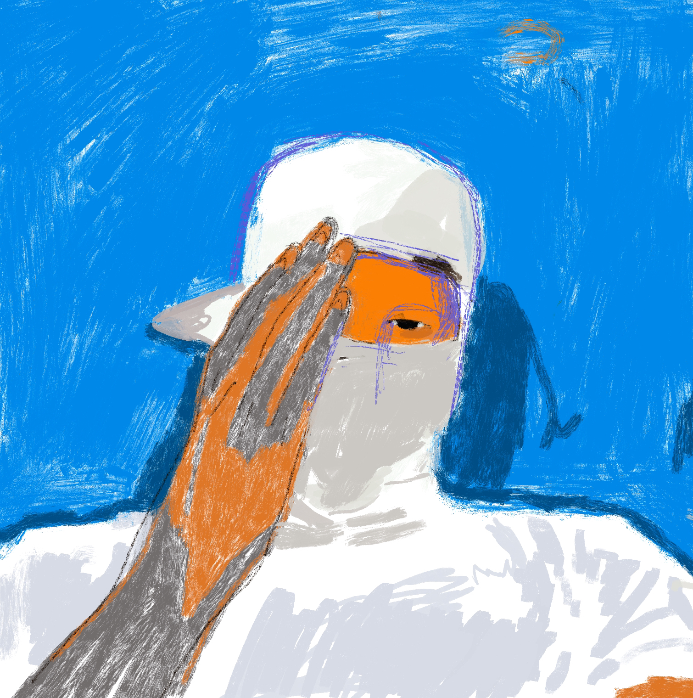
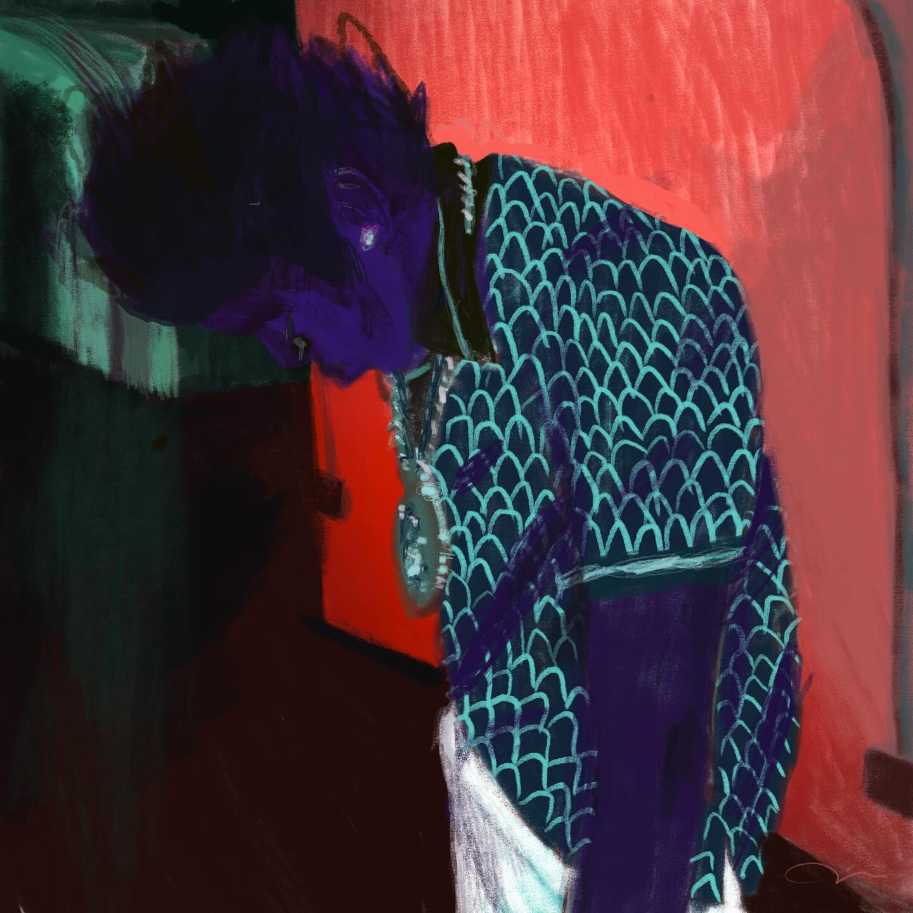
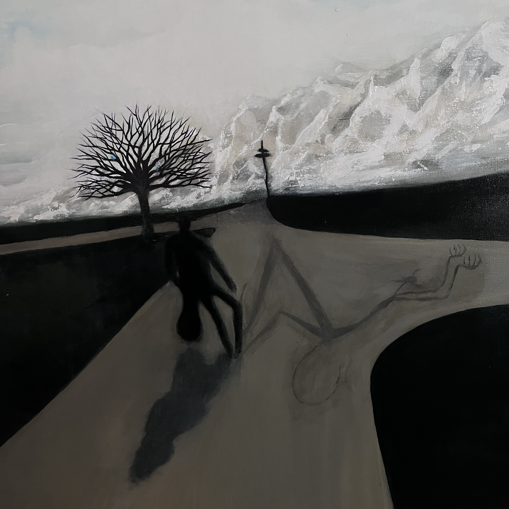
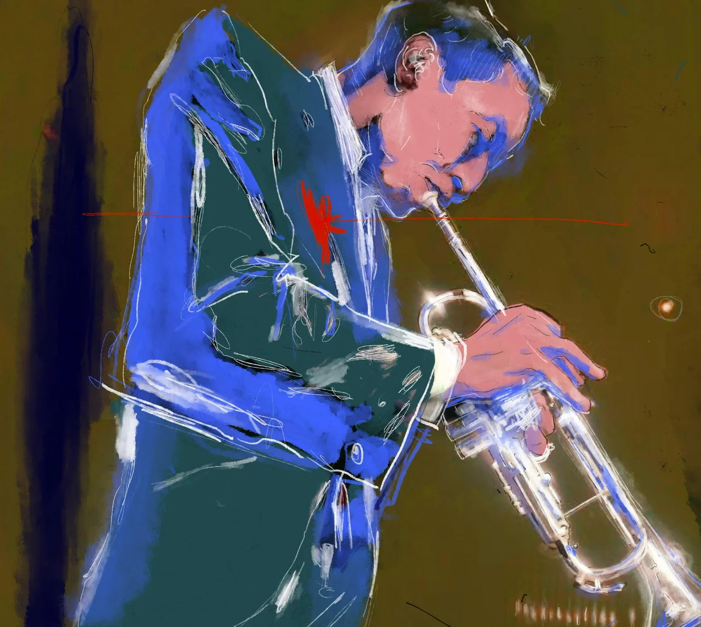
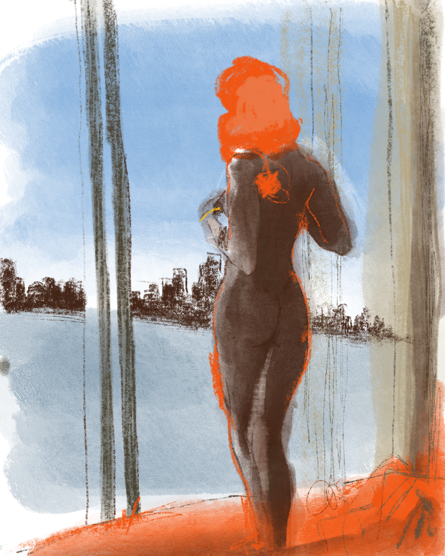
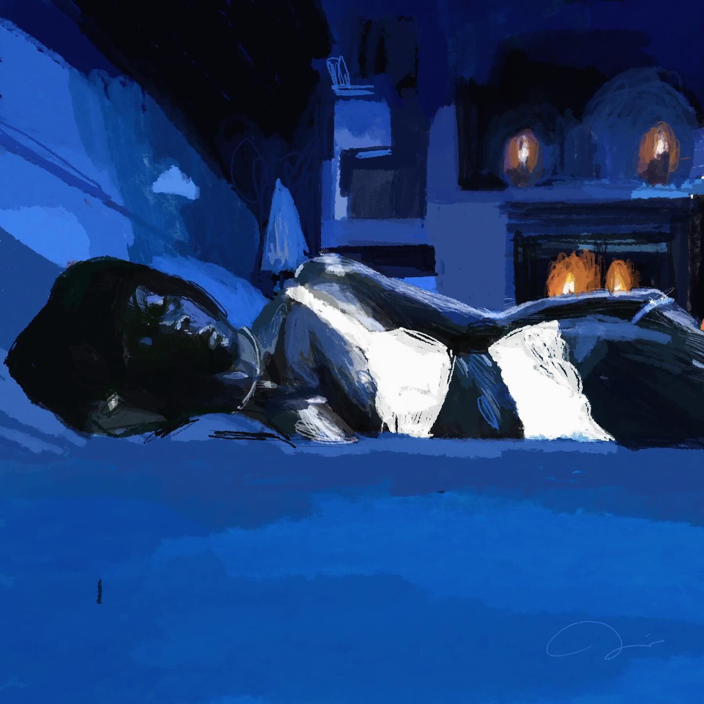
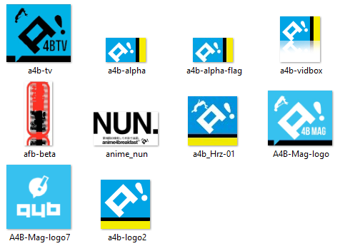
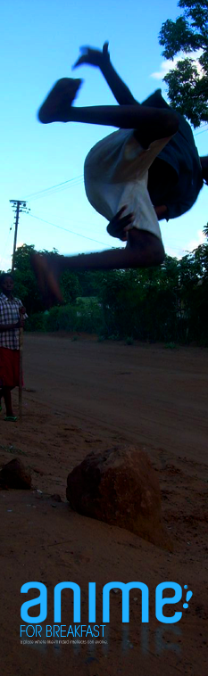

# Introduction
This is a portfolio of my artworks in the form of [Case Studies] the works you will see here may very between Graphics Design, Digital Design, Ux/Ui, Charcter Develoopment, and Product development. Please take the time to the review the works that I’ve shown here, Some are apart of projects I worked on and others are from my own curiosity, The projects are compartmentalized the help the the viewer to understand the wide range of works in my porfilio. I will be updating this priodicaly.
[Link to another page](./another-page.html).

There should be whitespace between paragraphs.


### Artworks Codex Feb 2019 - present
This was the chapter where I made the conscious decision to prioritize my own growth and well-being. I knew it was time to give back to myself, to nurture that part of me that had been waiting patiently beneath the surface. I embarked on a journey into the depths of my creative expression, embracing the process not just as an artist but as an individual seeking transformation. Through the lens of fine art, I discovered the freedom to explore new techniques, push my boundaries, and fully immerse in the act of creation. This practice became a blend of artistic passion and inner discipline—a space where I could reflect, refine, and rediscover who I am at my core.

Engaging in this way wasn’t just about making art; it was about crafting a life where creativity and mindfulness intertwined, giving me the foundation to express myself with authenticity and purpose.



#### I4NI |	Collection - Spooky
* * *
I4NI: A Testament to Misunderstood Youth
In the intricacies of societal perceptions, I4NI emerges as a profound artistic statement that dissects the veiled interpretations of youth seen through the lens of uncertainty and trepidation. This compelling piece encapsulates the duality of youthful existence—a narrative shaped not by their own truths but by the apprehensions and misapprehensions of those observing from the outside. The title itself, a cryptic expression of “Eye for an Eye,” challenges the viewer to reexamine the reactive, often defensive ways society approaches the unknown.



#### Sweet sweetblack’s Badass Song | Collection - Sepia
* * *
The Art of Resilience: Kodak Black as the Modern Sweetback
In the luminous canon of Blaxploitation cinema, Melvin Van Peebles’ Sweet Sweetback’s Baadasssss Song stands as a defiant, kinetic ode to survival, resistance, and the raw essence of self-determination. It’s within this framework that one can draw a seamless, almost mythical comparison to Kodak Black—a contemporary artist whose life and art form an unscripted narrative of struggle and tenacity. His world reflects the bruised, unfiltered resilience that Sweetback embodied, breathing life into the shared tale of overcoming systemic adversity.



#### The Ddevil's Shadow
* * *


#### The Great Reset
* * *

#### Some kind of Blue
* * *

#### Penthouse
* * *

#### Madame Bingo
* * *

#### Oh Mini
* * *

#### The Great Reset
* * *

#### Got your back
* * *

#### Keisha Bed
* * *


# Art Collectives and Personal Project Outreach
  I collaborated with artists across a range of mediums to support and refine their creative practices. Through these partnerships, I gained hands-on experience in understanding the unique techniques and perspectives that each art form demands. This involvement not only deepened my appreciation for diverse artistic expressions but also enhanced my ability to contribute effectively to creative projects, bridging ideas and execution across various crafts.

### Case study - anime4breakfast


***a4b! blog season -***
> *Anime4Breakfast! (a4b!) is a dynamic cultural space that celebrates the seamless blend of anime and daily life, turning each morning into an electrifying ritual for enthusiasts and casual fans alike. At its core, a4b! aims to invigorate the day’s start with the rich storytelling, vivid art, and diverse narratives that anime offers—a medium that inspires and captivates millions around the world.*


***a4b! issue #2 banner -*** 

> "This marked the inception of JoyBoy. JoyBoy was born from the emotions that surge within me during the creative process. I aimed to capture and embody that essence in this banner after being profoundly inspired by this image."eated from the feelings I have when I create my, I wanted to inbody that feeling in the banner after seeing that this image."







### Case study - KC93 RR

```js
// Javascript code with syntax highlighting.
var fun = function lang(l) {
  dateformat.i18n = require('./lang/' + l)
  return true;
}
```
### Case study - MDNKA Midnight Kids Academy

```ruby
# Ruby code with syntax highlighting
GitHubPages::Dependencies.gems.each do |gem, version|
  s.add_dependency(gem, "= #{version}")
end
```

#### Header 4

*   This is an unordered list following a header.
*   This is an unordered list following a header.
*   This is an unordered list following a header.

##### Header 5

1.  This is an ordered list following a header.
2.  This is an ordered list following a header.
3.  This is an ordered list following a header.

###### Header 6

| head1        | head two          | three |
|:-------------|:------------------|:------|
| ok           | good swedish fish | nice  |
| out of stock | good and plenty   | nice  |
| ok           | good `oreos`      | hmm   |
| ok           | good `zoute` drop | yumm  |

### There's a horizontal rule below this.

* * *

### Here is an unordered list:

*   Item foo
*   Item bar
*   Item baz
*   Item zip

### And an ordered list:

1.  Item one
1.  Item two
1.  Item three
1.  Item four

### And a nested list:

- level 1 item
  - level 2 item
  - level 2 item
    - level 3 item
    - level 3 item
- level 1 item
  - level 2 item
  - level 2 item
  - level 2 item
- level 1 item
  - level 2 item
  - level 2 item
- level 1 item

### Small image


### Large image


### Definition lists can be used with HTML syntax.

<dl>
<dt>Name</dt>
<dd>Godzilla</dd>
<dt>Born</dt>
<dd>1952</dd>
<dt>Birthplace</dt>
<dd>Japan</dd>
<dt>Color</dt>
<dd>Green</dd>
</dl>

```
Long, single-line code blocks should not wrap. They should horizontally scroll if they are too long. This line should be long enough to demonstrate this.
```

```
The final element.
```
