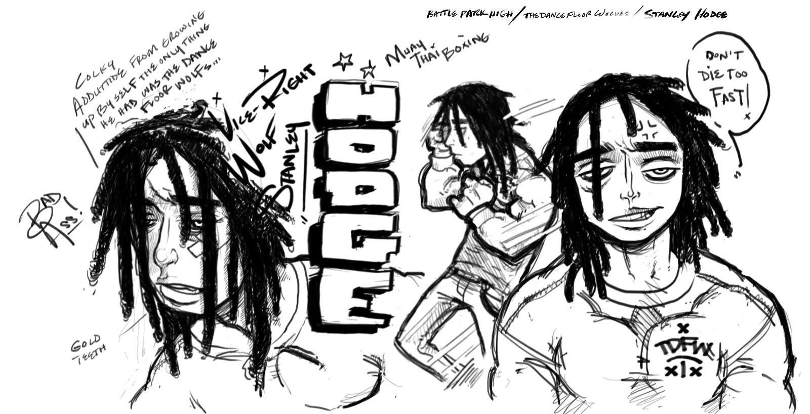
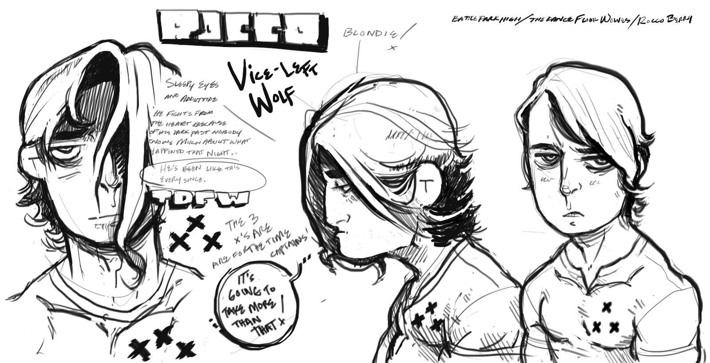
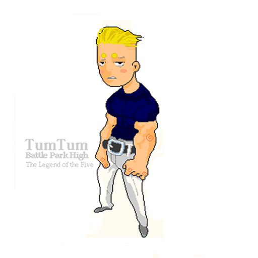

 
 
 
 
 

### Portfolio Introduction

> This is a portfolio of my artworks in the form of **[Case Studies]** the works you will see here may very between Graphics Design, Digital Design, Ux/Ui, Charcter Develoopment, and Product development.

 
 
 
 

--  Artworks
 
 

### Artworks Codex 
Feb 2019 - present

> The latest works of my fine art journey, the devepment of my oun mythos and metamorphsis. 

[unpack](./artworks-codex.md)

 
 
 

### Art Collectives and Personal Project Outreach

> I collaborated with artists across a range of mediums to support and refine their creative practices. Through these partnerships, I gained hands-on experience in understanding the unique techniques and perspectives that each art form demands. This involvement not only deepened my appreciation for diverse artistic expressions but also enhanced my ability to contribute effectively to creative projects, bridging ideas and execution across various crafts.

[unpack](./art-collectives-and-personal-project-outreach.md)

### Game Development

vkdsoc sapokcpksack a[pskPKCx[ksapc[k[askc ap CSPSACk]]]]

#### Case study - BPH Battle Park High

*Park High Reborn*  

Metreon City is unraveling. Ravaged by violent turf wars, its streets belong to rival gangs of angry teens, each vying for dominance in an endless cycle of chaos. The city’s most dangerous battlegrounds aren't just the alleyways but the high schools, where grudges turn into warfare and alliances are forged in blood.  

At the heart of this turmoil is **Park High**, a school barely holding itself together under an uneasy truce with a rival institution. But peace shatters when Yogi, a spirited freshman, is ambushed and left hospitalized by **T.D.F.W.**—The Dance Floor Wolves—a ruthless gang on the rise, led by the cold-blooded Silas Marks and his band of five notorious loners.  

Yogi’s closest friends—Winnie, Tum-Tum, Pooma, and "Ice" Coda—are forced to make a choice. Bound by loyalty to their fallen friend and a shared pride in their school, these four reluctant allies embark on a dangerous journey across enemy territory, where every corner hides a threat and every shadow is a trap.  

Though they come from different walks of life and aren’t the tightest-knit group, their mutual respect and unwavering determination unite them. To bring down T.D.F.W. and reclaim their school, they must confront not only the Wolves but also their own fears, doubts, and limits.  

This is the story of four freshmen rising to legendary status. A tale of brotherhood forged in fire, of a school defended against all odds, and of a city on the brink. But the question remains: **will they have what it takes to survive the fight of their lives?** 

#### The famous five freshmen of the first year battle:

**YOGI** - Choovio Raymond
Park High All Boys Continuation School
1st Year Freshmen*

#### Yogi: The Relentless Fighter of Park High 

Yogi, a hotheaded freshman with a volatile temper, is a name that strikes fear and respect throughout Metreon. Expelled from nearly every middle school in the city for fighting and defiance, his reputation as an unrelenting brawler was forged in the chaos of street battles and schoolyard clashes. Yogi's combative nature stems from a deeply personal tragedy—the loss of his sister, Enola, in an accident he witnessed as a child. This event left him grappling with life and death, channeling his pain into a relentless pursuit of strength.  

[Deep story verion](./yogis-story.md)

**ICE CODA**
Park High All Boys Continuation School
1st Year Freshmen*

**Ice Coda: The Shadow King of Park High**  

From the moment Ice Coda set foot in Park High, the school’s corridors buzzed with tension. Known across Metreon City as a figure of ruthless precision, Ice wasn’t there to blend in—he was there to conquer. Cold, calculating, and unshakable, he carried the weight of a reputation that left even the boldest delinquents hesitant to cross him.  

Pixel sprite variation of **ICE Coda** 

At Park High, Ice’s reputation as a tactical mastermind preceded him. In the Freshman Battle tournament, his surgical fighting style left opponents battered and broken before they realized the fight had even started. His cold efficiency and unflinching calm made him the most feared contender in the arena, his icy stare enough to shake even the most hardened fighters.  

 [Deep story verion](./coda-story.md)

**Antagonist Gang - Dance Floor Wolfs** 

**Hodge** Vice Right-Hand - 

**Rocco** Vice Left-Hand -

**TumTum** Pixel